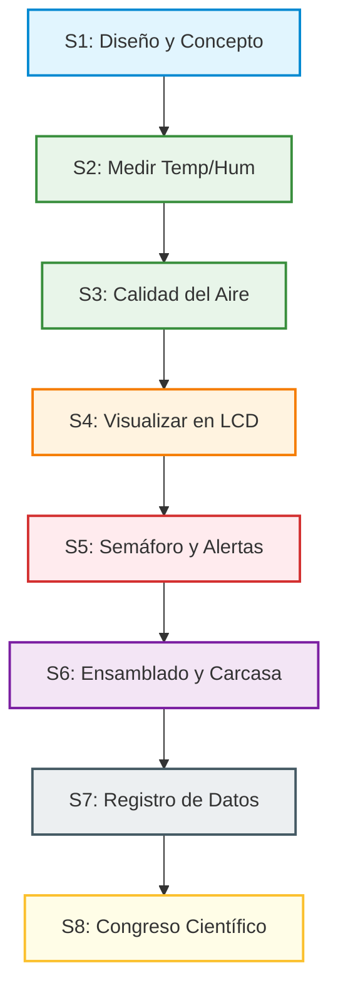

# Guía del Docente: Estación Meteorológica Inteligente
## Trayecto: NovaMakers Avanzado (9 a 12 años)

¡Te damos la bienvenida a la **Guía de Estación Meteorológica Inteligente**! Este es un proyecto pedagógico diseñado bajo el enfoque **STEAM** (Ciencia, Tecnología, Ingeniería, Arte y Matemática) y la metodología de **Aprendizaje Basado en Proyectos (ABP)**. 

A lo largo de este trayecto, tus estudiantes no solo aprenderán a conectar componentes y programar código en Arduino; se convertirán en **científicos ambientales**, analizando datos de su entorno para entender fenómenos climáticos reales y comunicar sus hallazgos a la comunidad.

---

## 🎯 Objetivos de Aprendizaje

Al finalizar este proyecto, los estudiantes serán capaces de:
1. **Comprender y medir variables físicas**: Identificar qué son la temperatura, la humedad y los gases en el aire, y cómo se relacionan entre sí y con el confort humano.
2. **Pensar de forma computacional**: Diseñar y entender la lógica de un programa secuencial, el uso de condicionales para la toma de decisiones (semáforo de alerta) y el funcionamiento de sensores y actuadores.
3. **Analizar datos empíricos**: Registrar datos en formato de serie temporal, graficarlos e identificar patrones climáticos o de contaminación.
4. **Trabajar de forma colaborativa**: Asumir roles específicos dentro de su equipo de investigación (Hardware, Software, Diseño y Comunicación).
5. **Comunicar sus descubrimientos**: Exponer su estación final y sus análisis en un Congreso Científico Escolar usando vocabulario técnico adecuado.

---

## 🗺️ Mapa de Progresión del Aprendizaje

El proyecto está diseñado de forma modular y progresiva. Cada sesión construye sobre la anterior, aumentando la complejidad técnica de forma gradual y amigable.

---

## 📅 Estructura del Trayecto (Sesión a Sesión)

A continuación, se detalla la planificación sugerida para las 8 sesiones. Cada sesión está pensada para una duración típica de **90 a 120 minutos**.

| Sesión | Título | Descripción Técnica | Hito / Entregable | Enlace al Detalle |
| :---: | :--- | :--- | :--- | :---: |
| **1** | [Introducción al Clima y Diseño](sesiones/s1-introduccion.md) | Análisis de estaciones reales, diseño en papel de la interfaz y la carcasa. | Boceto de la estación y mapa mental. | [Ver Guía S1](sesiones/s1-introduccion.md) |
| **2** | [Mi Primer Sensor (DHT11)](sesiones/s2-sensor-dht11.md) | Conexión del sensor DHT11 y lectura de datos por Monitor Serial. | Monitorización de temperatura y humedad. | [Ver Guía S2](sesiones/s2-sensor-dht11.md) |
| **3** | [¿Qué Respiramos? (MQ-135)](sesiones/s3-sensor-mq135.md) | Conexión del sensor MQ-135 y calibración básica para calidad del aire. | Clasificación cualitativa del aire (Limpio/Sucio). | [Ver Guía S3](sesiones/s3-sensor-mq135.md) |
| **4** | [Pantalla en Acción (LCD)](sesiones/s4-display-lcd.md) | Uso del display LCD 16x2 paralelo tradicional para mostrar datos en vivo con caracteres custom. | Interfaz física que rota pantallas de información. | [Ver Guía S4](sesiones/s4-display-lcd.md) |
| **5** | [Semáforo de Alerta Ambiental](sesiones/s5-semaforo-ambiental.md) | Lógica de control para encender LEDs y buzzer según umbrales de peligro. | Estación que reacciona físicamente ante emergencias. | [Ver Guía S5](sesiones/s5-semaforo-ambiental.md) |
| **6** | [El Producto Terminado](sesiones/s6-ensamblado.md) | Ensamblado final de la electrónica dentro de una carcasa (cartón, 3D, MDF). | Prototipo físico terminado y testeado. | [Ver Guía S6](sesiones/s6-ensamblado.md) |
| **7** | [El Tiempo Pasa: Series Temporales](sesiones/s7-registro-datos.md) | Envío de datos como formato CSV y análisis en planilla de cálculo. | Informe técnico con gráficos de tendencia. | [Ver Guía S7](sesiones/s7-registro-datos.md) |
| **8** | [Congreso de Meteorología](sesiones/s8-congreso.md) | Presentación de resultados y evaluación compartida (co-evaluación). | Exposición del stand y evaluación del proyecto. | [Ver Guía S8](sesiones/s8-congreso.md) |

---

## 🛠️ Organización de la Guía y Recursos del Aula

Para facilitar tu labor como docente, este repositorio de recursos incluye secciones específicas:

* 📋 **[Lista de Materiales y Roles](materiales.md)**: El listado completo de componentes necesarios para el aula y cómo organizar a tus estudiantes en equipos de 4 personas.
* 💬 **[Preguntas de Debate y Conceptos](preguntas-debate.md)**: Una guía teórica con respuestas amigables para niños sobre el funcionamiento físico y químico de los sensores.
* 🔌 **[Diagramas de Conexión](diagramas/s6-completo.md)**: Esquemas de conexión física detallados en formato ASCII paso a paso para evitar errores comunes y cortocircuitos.
  * *Variante:* [Diagrama Conexión Semáforo LED RGB](diagramas/s5-semaforo-rgb.md).
* 💾 **[Códigos de Código Fuente](codigo/)**: Archivos independientes y completos con comentarios pedagógicos línea a línea en español.
  * *Variante:* [Semáforo RGB (s5_semaforo_rgb.cpp)](codigo/s5_semaforo_rgb.cpp) y [Estación Completa RGB (s6_estacion_completa_rgb.cpp)](codigo/s6_estacion_completa_rgb.cpp).
* 📝 **Recursos de Evaluación**:
  * [Plantilla de Tabla de Umbrales](recursos/plantilla-tabla-umbrales.md): Ficha de trabajo para definir las alertas del semáforo.
  * [Plantilla de Informe Técnico](recursos/plantilla-informe-tecnico.md): Estructura para el registro científico de datos.
  * [Rúbrica de Evaluación para el Congreso](recursos/rubrica-congreso.md): Herramienta objetiva para evaluar la presentación grupal.

---

## 💡 Consejos de Facilitación Pedagógica

1. **El error como motor de aprendizaje**: Si un circuito no funciona o el código da error, ¡es una excelente noticia! Incentiva a los estudiantes a usar el método del "detective" para encontrar la falla (¿es un cable suelto?, ¿falta un punto y coma en el código?).
2. **Promueve la rotación de roles**: Evita que un estudiante siempre programe y otro siempre arme el circuito. El trabajo cooperativo es clave.
3. **Seguridad ante todo**: Antes de conectar la placa Arduino a la computadora, asegúrate de que el equipo verifique el circuito con el diagrama para evitar cortocircuitos.

¡Disfruta el proceso de guiar a tus NovaMakers en esta aventura tecnológica y ambiental!
