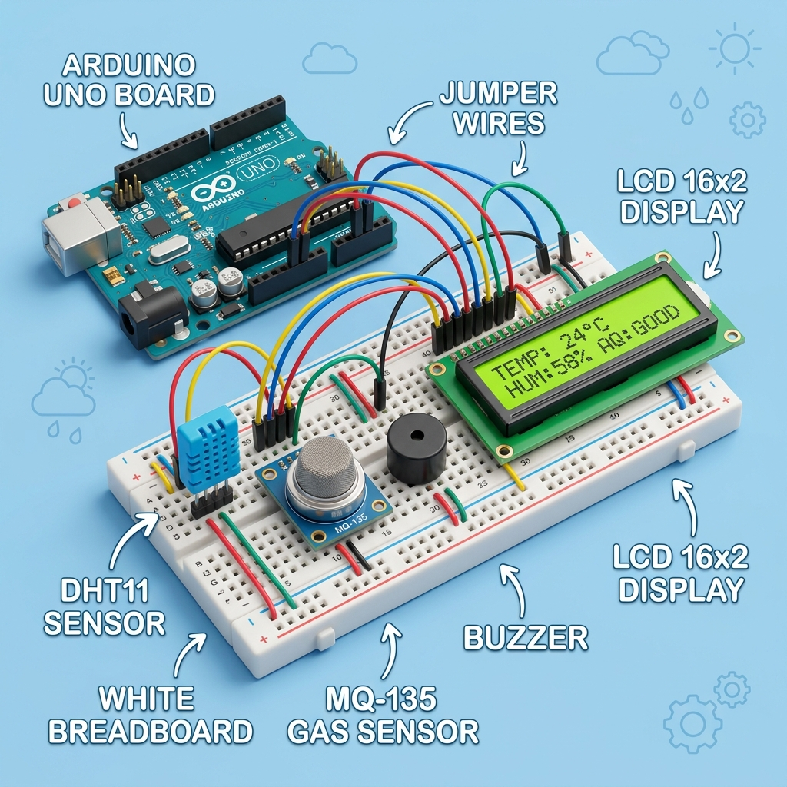

# Guía de Materiales y Organización de Equipos
## Recursos físicos, roles de trabajo y enlaces conceptuales

Para llevar adelante el proyecto de la **Estación Meteorológica Inteligente** de forma exitosa en el aula, es fundamental organizar tanto los componentes electrónicos como la dinámica de trabajo de los estudiantes. Esta guía detalla los materiales requeridos por equipo y propone una estructura de roles colaborativos diseñada especialmente para niños de 9 a 12 años.



---


## 🛠️ Lista de Materiales por Equipo (3-4 Estudiantes)

Se recomienda que cada equipo disponga de una caja organizadora con los siguientes elementos:

| Componente | Imagen / Símbolo | Cantidad | Función Principal | Enlace Conceptual / Explicación |
| :--- | :---: | :---: | :--- | :--- |
| **Arduino Uno R3** | 🔌 | 1 | Cerebro procesador de la estación. Recibe datos de sensores, ejecuta el código y controla los actuadores. | [¿Qué es un microcontrolador?](https://learn.adafruit.com/adafruit-arduino-lesson-1-whats-an-arduino) (Placa programable). |
| **Cable USB A-B** | 💻 | 1 | Conecta la placa Arduino a la computadora para cargar el programa y enviar datos por puerto Serie. | Transporta energía (5V) y datos del código. |
| **Protoboard (830 ptos)** | 🎛️ | 1 | Tablero de pruebas con conexiones internas que permite conectar componentes sin soldar. | [¿Cómo funciona una protoboard?](https://learn.adafruit.com/breadboards-for-beginners/how-a-breadboard-works) |
| **Sensor DHT11** | 🌡️💧 | 1 | Sensor digital de temperatura y humedad ambiental con salida calibrada. | [Funcionamiento del DHT11](https://learn.adafruit.com/dht) (Usa un termistor y un sensor capacitivo). |
| **Sensor MQ-135** | 🌬️ | 1 | Sensor químico analógico para medir la calidad del aire y detectar gases nocivos. | [Sensores de gas semiconductor](https://learn.adafruit.com/gas-sensor-comparison) (Nariz electrónica). |
| **Display LCD 16x2 I2C** | 📺 | 1 | Pantalla de cristal líquido que muestra caracteres (letras/números) organizados en 2 líneas de 16 caracteres. | [Funcionamiento del LCD e I2C](https://learn.adafruit.com/i2c-addresses/overview) (Usa protocolo de comunicación a 2 cables). |
| **LEDs (Rojo, Amarillo, Verde)** | 🟢🟡🔴 | 1 c/u | Indicadores luminosos que representan el nivel de alerta ambiental (Semáforo). | Diodos Emisores de Luz. Dejan pasar corriente en un solo sentido. |
| **Buzzer Pasivo** | 🔊 | 1 | Transductor piezoeléctrico que emite pitidos en diferentes tonos para alertas sonoras. | Genera ondas sonoras variando la frecuencia eléctrica. |
| **Resistencias de 220 Ω** | ⚡ | 3 | Protegen los LEDs limitando el paso de corriente eléctrica para evitar que se quemen. | Código de colores: Rojo-Rojo-Marrón-Dorado. |
| **Resistencia de 10 kΩ** | ⚡ | 1 | Resistencia de pull-up requerida para estabilizar la señal de datos del sensor DHT11. | Código de colores: Marrón-Negro-Naranja-Dorado. |
| **Cables Dupont Macho-Macho** | 🎗️ | ~20 | Cables de colores con puntas metálicas en ambos extremos para realizar las conexiones en la protoboard. | Usar diferentes colores ayuda a depurar el circuito. |
| **Carcasa Prototipo** | 📦 | 1 | Caja protectora donde se alojará la estación (pueden construirla con cartón, plástico, madera o impresión 3D). | Enfoque de Diseño y Usabilidad (interfaz física). |

---

## 👥 Organización de Equipos: Roles NovaMakers

Para fomentar la colaboración efectiva y asegurar que todos los miembros del equipo participen en todas las dimensiones del proyecto, se propone dividir las tareas bajo la metodología de **Roles Rotativos**. Cada sesión, los estudiantes pueden intercambiar sus roles:

```mermaid
grid-layout
[ LÍDER DE HARDWARE ] ────────── [ LÍDER DE SOFTWARE ]
         │                              │
         │                              │
[ DISEÑADOR DE INTERFAZ ] ────── [ CIENTÍFICO DE DATOS ]
```

### 1. 🔧 Líder de Hardware (Ingeniería y Conexiones)
* **Responsabilidad principal:** Encargarse de la protoboard, ubicar los componentes en el lugar correcto y conectar los cables hacia el Arduino.
* **Misión especial:** Verificar las conexiones junto al docente antes de conectar el cable USB a la computadora para garantizar que no existan cortocircuitos.

### 2. 💻 Líder de Software (Programación y Algoritmia)
* **Responsabilidad principal:** Escribir y subir el código desde la computadora a la placa Arduino usando el editor (PlatformIO o Arduino IDE).
* **Misión especial:** Leer los mensajes de error de compilación del software y proponer soluciones lógicas (verificar puntos y comas, llaves de funciones o nombres de variables).

### 3. 🎨 Diseñador de Interfaz y Carcasa (Diseño y Usabilidad)
* **Responsabilidad principal:** Diseñar la disposición física del display y los LEDs en la carcasa protectora, y decorar el contenedor exterior de la estación.
* **Misión especial:** Diseñar en papel el layout de la pantalla (cómo se verán las palabras en el LCD 16x2) y dibujar los iconos personalizados (gota, termómetro, carita feliz).

### 4. 📊 Científico de Datos y Comunicación (Ciencia y Registro)
* **Responsabilidad principal:** Anotar en el cuaderno de bitácora las lecturas de los sensores, medir los tiempos de reacción y verificar que los datos tengan sentido físico.
* **Misión especial:** Liderar la preparación de los gráficos en la sesión 7 y estructurar la presentación oral del equipo para el Congreso Científico de la sesión 8.

---

## 💡 Consejos para la Gestión del Material en el Aula

1. **El "Inventario de Inicio y Cierre":** Dedica los primeros 3 minutos de cada clase a que los equipos verifiquen que tienen todos sus materiales, y los últimos 5 minutos a guardarlos ordenadamente en su caja correspondiente. Esto enseña responsabilidad y cuidado de las herramientas.
2. **Código de Colores de Cables:** Enseña a los estudiantes una convención básica de colores para los cables Dupont:
   * **Rojo o Naranja:** Siempre para alimentación positiva (VCC / 5V).
   * **Negro o Marrón:** Siempre para tierra (GND).
   * **Otros colores (Azul, Amarillo, Verde, Blanco):** Para señales de datos y sensores.
   Esto reduce los errores de conexión en un 80%.
